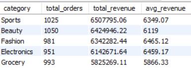
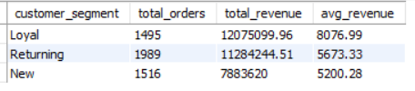
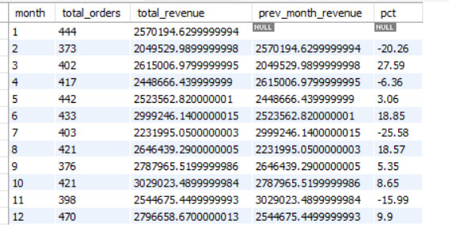
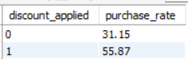
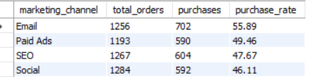
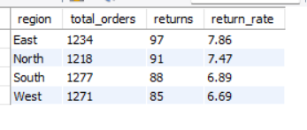

# E-Commerce Sales & Customer Behavior Analytics

**Project Overview**

This project delivers a full-stack analytics solution for an e-commerce business,covering customer behavior analysis, statistical hypothesis testing, SQL-based
querying & reporting, and machine learning — culminating in an interactive Power BI dashboard that translates data into actionable business decisions.

**Tech Stack**

Data Wrangling & EDA =	Python, Pandas, NumPy, Matplotlib, Seaborn
Statistical Testing = SciPy, Statsmodels
Database & Querying	= MYSQL
Machine Learning = Scikit-learn (LogisticRegression & Random Forest)
Dashboard	= Power BI
Version Control	= Git, GitHub

**Key Steps**

**Date Cleaning & Preprocessing**

Started with quick understanding of the data by viewing few of the first columns, checked for the datatypes looked for duplicate & missing values where payment method had null values which i imputed with **None** as to preserve those rows and maintain business logic consistency, since customers who did not complete a purchase would not have an associated payment method.

 **Exploratory Data Analysis (EDA)**
   
Analyzed revenue distribution across categories and regions

Plotted a correlation heatmap in order to look for the correlation across all numeric features

Analysed the return rate across categories for understanding which category had the most return rate

Checked for the discount impact on orders to know if promotional(discounted) pricing played a major role in customer purchasing behavior 

##  Hypothesis Testing (Statistics Layer)

Two statistical tests were performed to validate key business assumptions.

---

### Test 1 — Does revenue differ across customer segments?
**Method:** One-Way ANOVA (`f_oneway`)

| | |
|---|---|
| **H0** | Revenue is equal and does not differ across customer segments |
| **H1** | Revenue is not equal and differs across customer segments |
| **F-statistic** | 41.65399762337787 |
| **p-value** | 1.14e-18 |
| **Decision** | ** Reject H0** (p < 0.05) |

**Interpretation:**
Statistical evidence confirms that revenue is not equal & differs across customer segments.
This is validated by the average revenue per segment & can be clearly seen that loyal segment is generating higher revenue in comparison to other segments

| Segment | Avg Revenue |
|---|---|
| Loyal | 8076.99|
| Returning | 5673.33|
| New | 5200.28 |

The difference between segments is too small to be statistically significant.

### Test 2 — Does discount affect revenue?
**Method:** Independent t-test (`ttest_ind`)

| | |
|---|---|
| **H0** | There is no difference in revenue after discount is applied |
| **H1** | There is a difference in revenue after discount is applied |
| **p-value** | 3.67e-09 |
| **Decision** | **Reject H0** (p < 0.05) |

**Interpretation:**
Statistical evidence confirms that applying a discount significantly affects revenue.
Orders **without** discount generated higher average revenue than orders **with** discount:

| Group | Avg Revenue |
|---|---|
| No Discount Applied | ₹9,465 |
| Discount Applied | ₹7,764 |

**Insights & Recommendations**

1. Product Category Performance
Sports & Beauty category generated the highest average revenue at 6507795.06 & 6424946.22 respectively outperforming other categories. This indicates strong customer demand and higher monetization potential within premium-performing categories.

Business Recommendation:
Increase inventory allocation, targeted promotions, and cross-selling strategies for high-performing categories while reassessing pricing, assortment, or marketing strategy for underperforming categories.

2. Customer Segment Contribution
Loyal customers generated approximately ₹12075099.96 higher revenue and average revenue of 8076.99 compared to New & Returning customers, highlighting the strong lifetime value and purchasing power of retained customers.

Business Recommendation:
Strengthen customer retention initiatives such as loyalty programs, personalized offers, and membership benefits to maximize repeat purchases and long-term revenue growth.

3. Seasonal Revenue Trends
Revenue peaked during month 6 & 10 indicating a seasonal purchasing behavior and periods of heightened customer demand across the business cycle.

Business Recommendation:
Optimize inventory planning, marketing campaigns, and staffing capacity ahead of peak-demand quarters to capitalize on seasonal sales opportunities and avoid stock shortages.

4. Impact of Discounts on Purchase Conversion
Customers receiving discounts demonstrated a significantly higher purchase rate (55.87%) compared to customers without discounts (31.15%), indicating that promotional pricing is strongly associated with increased customer conversion behavior.

Business Recommendation:
Implement targeted discount strategies focused on high-conversion customer groups while monitoring profitability to balance revenue growth with margin sustainability.

5. Marketing Channel Effectiveness
Email achieved the highest purchase conversion rate at 55.89 %, indicating superior effectiveness in driving customer engagement and completed purchases.

Business Recommendation:
Increase marketing investment and campaign optimization efforts on high-performing acquisition channels while evaluating ROI improvements for lower-performing channels.

6. Regional Return Analysis
Region East recorded the highest return rate at 7.86 %, suggesting potential operational, product-quality, or customer expectation issues within that market.

Business Recommendation:
Conduct deeper root-cause analysis on returns in the affected region by reviewing delivery performance, product quality, and customer feedback to reduce return-related losses and improve customer satisfaction.

**Power BI Dashboard**

**Machine Learning Model**

Objective
Predict whether a customer will make a purchase (`purchase_made`: 0 or 1)

### Features Used
age, gender, region, customer_segment, category,
discount_offered, marketing_channel, review_score,
discount_pct, month, quarter

### Preprocessing
- Categorical encoding via `pd.get_dummies` with `drop_first=True`
- Leakage-free feature selection — all transaction-derived columns excluded
- Train / Test split: **80% / 20%**

---

### Models Trained & Compared

| Model | Accuracy | Precision | Recall | F1-Score |
|---|---|---|---|---|
| Logistic Regression | 62.4% | 0.62 | 0.62 | 0.62 |
| Random Forest (default) | 56.9% | 0.57 | 0.57 | 0.57 |
| Random Forest (tuned) | 61.5% | 0.62 | 0.61 | 0.61 |
| RF + Threshold (0.3) | 54.4% | 0.62 | 0.54 | 0.54 |

---

### Model Selection & Business Reasoning

> *"This is a synthetic dataset designed to simulate real-world behavior with controlled relationships. Instead of maximizing accuracy, the model was optimized for business impact."*

Three approaches were evaluated:

**Logistic Regression** performed best on raw accuracy (62.4%) and served as a strong, interpretable baseline.

**Random Forest tuned** (`n_estimators=200, max_depth=8, min_samples_split=10, class_weight='balanced'`) improved recall on purchasers (Class 1) to **0.69**, making it better at capturing actual buyers.

**Threshold Lowering (0.3)** pushed recall on Class 1 to **0.94** — meaning the model captures **9 out of 10 potential buyers**, at the cost of precision. This is the most valuable configuration in a **marketing context** where missing a real buyer is costlier than over-targeting.

---

### Final Chosen Strategy — Threshold Optimized RF

| Metric | Class 0 (No Purchase) | Class 1 (Purchase) |
|---|---|---|
| Precision | 0.73 | 0.52 |
| Recall | 0.16 | **0.94** |
| F1-Score | 0.26 | 0.67 |

**Confusion Matrix:**
Predicted →      0     1
Actual 0       [  82   425 ]
Actual 1       [  31   462 ]

**Business Insight:** 

- In a marketing campaign, it is far more costly to miss a potential buyer than to target an extra customer who does not convert
- sending one unnecessary email costs almost nothing, but missing a ready buyer means lost revenue permanently.
